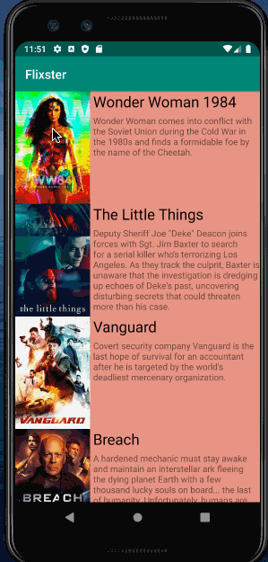
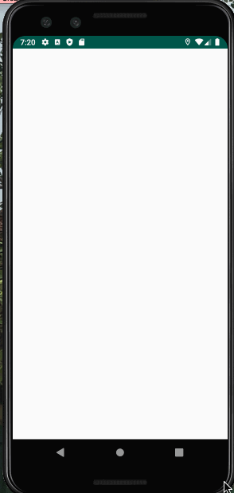
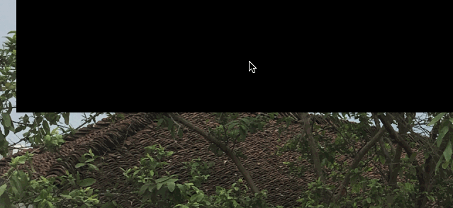

## Flix Part 2

### User Stories

#### REQUIRED (10pts)

- [x] (8pts) Expose details of movie (ratings using RatingBar, popularity, and synopsis) in a separate activity.
- [x] (2pts) Allow video posts to be played in full-screen using the YouTubePlayerView.

### App Walkthough GIF

`TODO://` Add the URL to your animated app walkthough `gif` in the image tag below, `YOUR_GIF_URL_HERE`. Make sure the gif actually renders and animates when viewing this README. (🚫 Remove this paragraph after after adding gif)

## Open-source libraries used
- [Android Async HTTP](https://github.com/codepath/CPAsyncHttpClient) - Simple asynchronous HTTP requests with JSON parsing
- [Glide](https://github.com/bumptech/glide) - Image loading and caching library for Android

# Unit 1 Project: - *Flixster - Part 1*

**Flixster** shows the latest movies currently playing in theaters. The app utilizes the Movie Database API to display images and basic information about these movies to the user.

Time spent: **4** hours spent in total

## User Stories

The following **required** functionality is completed:

* [X] User can **scroll through current movies** from the Movie Database API
* [X] For each movie displayed, user can see the following details:
  * [X] Title, Poster Image, Overview (Portrait mode)
  * [X] Title, Backdrop Image, Overview (Landscape mode)

The following **stretch** features are implemented:

* [X] Display a default progress bar for each image during loading

## Video Walkthrough

Here's a walkthrough of implemented user stories:

GIF created with [LiceCap](http://www.cockos.com/licecap/).

## Notes

It was challenging to add a progress bar for when each image is loading. I eventually resolved it by understanding what an adapter does and how it relates to how the app layout is shown.

## Open-source libraries used

- [Android Async HTTP](https://github.com/loopj/android-async-http) - Simple asynchronous HTTP requests with JSON parsing
- [Glide](https://github.com/bumptech/glide) - Image loading and caching library for Android

## License

    Copyright [yyyy] [name of copyright owner]

    Licensed under the Apache License, Version 2.0 (the "License");
    you may not use this file except in compliance with the License.
    You may obtain a copy of the License at

        http://www.apache.org/licenses/LICENSE-2.0

    Unless required by applicable law or agreed to in writing, software
    distributed under the License is distributed on an "AS IS" BASIS,
    WITHOUT WARRANTIES OR CONDITIONS OF ANY KIND, either express or implied.
    See the License for the specific language governing permissions and
    limitations under the License.
